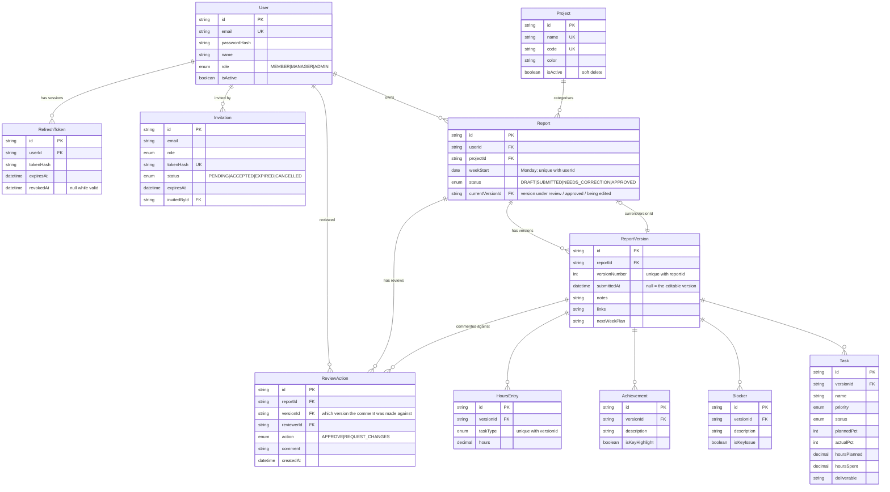

# Entity relationship diagram

Generated from `apps/api/prisma/*.prisma`. Two relationships carry the design and
are annotated below the diagram.



## The two annotations that matter

**`Report.currentVersionId`** points at the version under review, approved, or
being edited. It is denormalized deliberately and kept correct inside the same
transaction as every status change, so analytics joins
`Report → currentVersion → children` directly instead of running a correlated
subquery for "the latest submitted version".

**`ReviewAction.versionId`** records which version a comment was made against.
Because the row is written in the same transaction that clones v(n) into v(n+1),
"which version was this comment about" is a column rather than a heuristic — and
the same append-only table gives the full comment history for free.

## Regenerating

The diagram above is maintained by hand against the schema. To generate one
instead:

```bash
pnpm --filter cadence-api add -D prisma-erd-generator @mermaid-js/mermaid-cli
# add a generator block to apps/api/prisma/schema.prisma, then:
pnpm --filter cadence-api exec prisma generate
```
